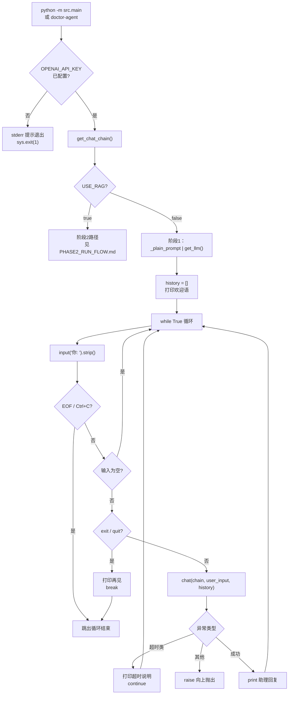
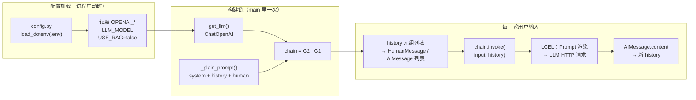
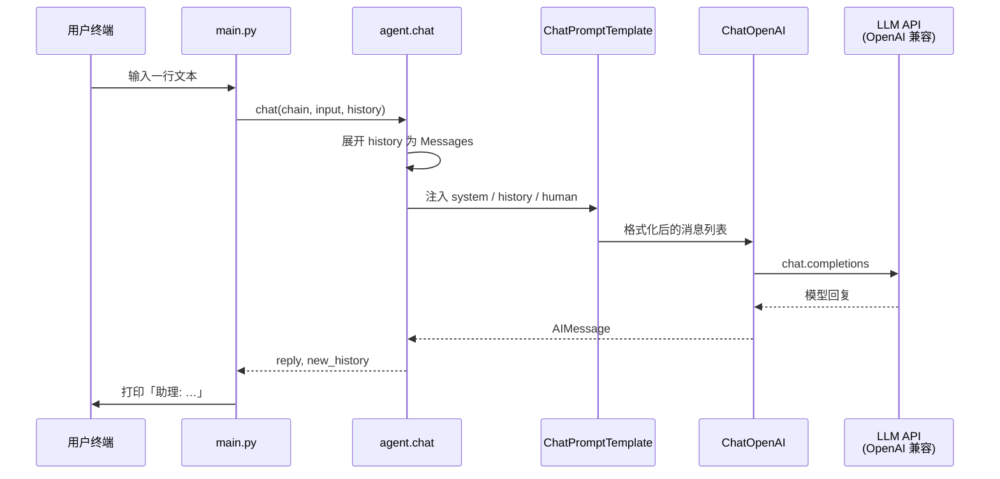

# 阶段 1 代码运行逻辑图（纯对话：`USE_RAG=false`）

> **说明**：阶段 1 指 **不启用 RAG** 的路径：`.env` 中 `USE_RAG=false`（或与 `true` 相对的关闭值）。此时 `get_chat_chain()` 返回 **`Prompt | ChatOpenAI`**，无 Chroma、无检索。

以下流程图使用 [Mermaid](https://mermaid.js.org/) 编写；在支持 Mermaid 的 Markdown 预览中可直接渲染。

---

## 1. 总览：从启动到一轮对话

---

## 2. 阶段 1 专用：`get_chat_chain()` → 单轮 `chat()`

---

## 3. 时序图：阶段 1 单次 `invoke` 在做什么

---

## 4. 与阶段 2 的分叉（对照）

| 条件 | `get_chat_chain()` 返回 | 多出来的步骤 |
|------|-------------------------|--------------|
| `USE_RAG=false` | `_plain_prompt \| llm` | 无 |
| `USE_RAG=true` | `RunnableLambda(检索) \| prompt \| llm` | Chroma 检索 → 注入 `context` |

---

## 5. 本地如何预览图

- **VS Code**：安装「Markdown Preview Mermaid Support」等插件后预览本文件。
- **GitHub**：将本文件推送到仓库后，在网页上打开 `.md` 即可渲染 Mermaid。
- **导出图片**：可用 [Mermaid Live Editor](https://mermaid.live/) 粘贴代码块内图表导出 PNG/SVG。

阶段 2（RAG + Chroma）专用流程图见 **[PHASE2_RUN_FLOW.md](./PHASE2_RUN_FLOW.md)**。  
阶段 3（ReAct + Tools）见 **[PHASE3_RUN_FLOW.md](./PHASE3_RUN_FLOW.md)**。
