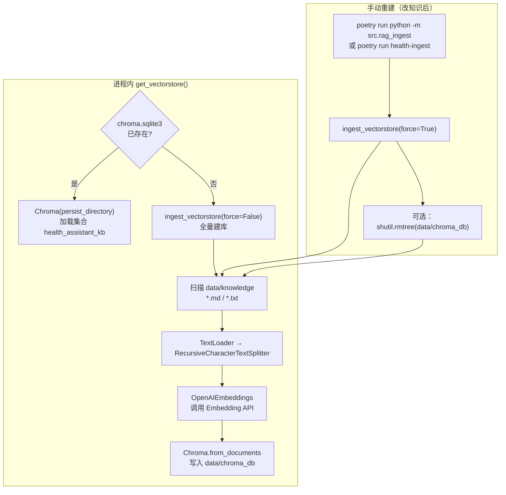
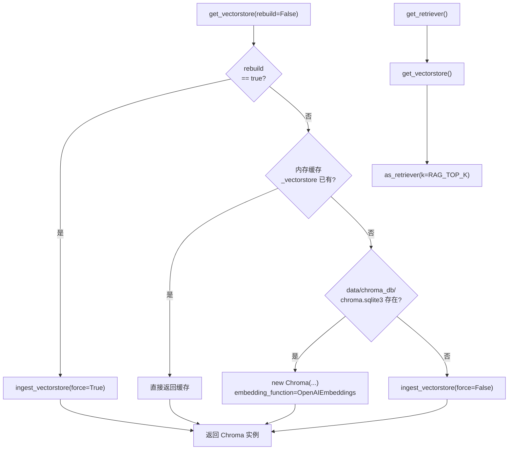
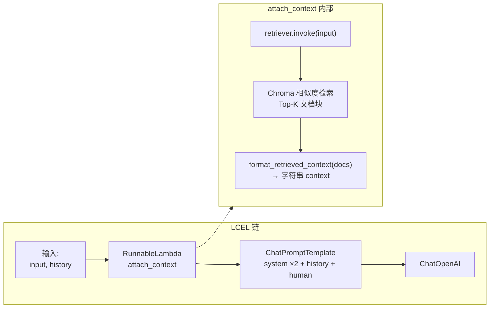
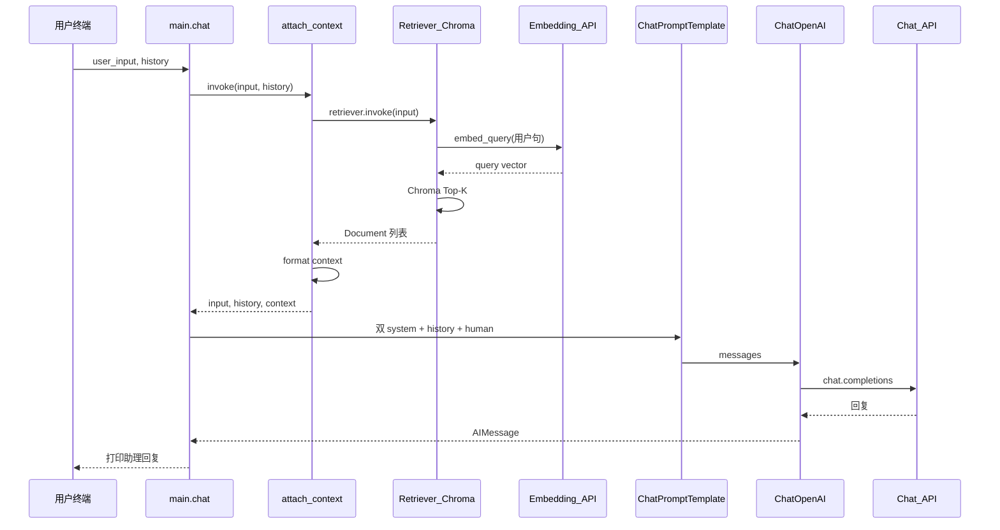

# 阶段 2 代码运行逻辑图（RAG + Chroma：`USE_RAG=true`）

> **说明**：阶段 2 在 **`.env` 中 `USE_RAG=true`（默认）** 时生效。对话前会 **用当前用户句检索本地 Chroma**，把检索文本注入第二条 `system`，再调用 **Chat LLM**。向量数据落在 **`data/chroma_db/`**（持久化），原始文档在 **`data/knowledge/`**。

以下使用 [Mermaid](https://mermaid.js.org/)，预览方式同 [PHASE1_RUN_FLOW.md](./PHASE1_RUN_FLOW.md)。

---

## 1. 向量库从哪来：ingest 与首次启动

**要点**：

- **Embedding** 与对话共用 `OPENAI_API_KEY` / `OPENAI_API_BASE`，模型名为 **`EMBEDDING_MODEL`**（百炼常见如 `text-embedding-v2`，以控制台为准）。
- **`load_knowledge_documents()`** 若返回空列表，`ingest` 会 **`FileNotFoundError`**，`main.py` 启动失败并提示先放文档或执行 ingest。

---

## 2. `get_vectorstore()` 决策（与缓存）

**`clear_vectorstore_cache()`**：仅在 **`rag_ingest` 成功后** 将 **`_vectorstore = None`**，避免同一进程里仍指向旧库；**`_embeddings`** 一般保留复用。

---

## 3. 对话链结构：`get_rag_chat_chain()`

**Prompt 消息顺序**（与代码一致）：

1. `SYSTEM_PROMPT`（健康助理人设）  
2. `RAG_CONTEXT_SYSTEM`（含 **`{context}`**）  
3. `MessagesPlaceholder(history)`  
4. `human: {input}`  

检索 **只使用当前用户句 `input`**，不把整段历史拼进向量查询。

---

## 4. 时序图：阶段 2 单轮对话（含 Chroma + 两次模型侧调用）

> **说明**：检索一步会把 **用户问题** 发给 **Embedding 接口** 做向量化；生成一步把 **完整消息** 发给 **Chat 接口**。两者模型不同（`EMBEDDING_MODEL` vs `LLM_MODEL`），计费与限流各自计算。

---

## 5. 与 `search_health_knowledge` 工具的关系

| 路径 | 作用 |
|------|------|
| **`get_rag_chat_chain()`** | 每轮对话 **自动** 检索并注入 context，用户无感。 |
| **`src/tools/rag_tool.py`** | 供 **阶段 3 ReAct** 显式调用；内部同样 `get_retriever()` + `format_retrieved_context()`。 |

阶段 2 的 CLI **不绑定** ReAct，工具文件可先单测或留到 Agent 再接。

---

## 6. 相关文件一览

| 文件 | 职责 |
|------|------|
| `src/rag.py` | 加载、分段、Chroma、retriever、格式化 context |
| `src/rag_ingest.py` | 强制重建索引 CLI |
| `src/agent.py` | `get_rag_chat_chain()`、`USE_RAG` 分支 |
| `src/prompts.py` | `RAG_CONTEXT_SYSTEM`（含 `{context}`） |
| `data/knowledge/` | 源文档 `.md` / `.txt` |
| `data/chroma_db/` | Chroma 持久化（勿提交 Git） |

---

## 7. 与阶段 1 的对照

详见 [PHASE1_RUN_FLOW.md](./PHASE1_RUN_FLOW.md)。简表：

| 项目 | 阶段 1 | 阶段 2 |
|------|--------|--------|
| 开关 | `USE_RAG=false` | `USE_RAG=true` |
| 链 | `_plain_prompt \| llm` | `Lambda(检索) \| prompt \| llm` |
| 本地存储 | 无 | `data/chroma_db` |
| 额外 API | 仅 Chat | Chat + Embedding（检索时） |
