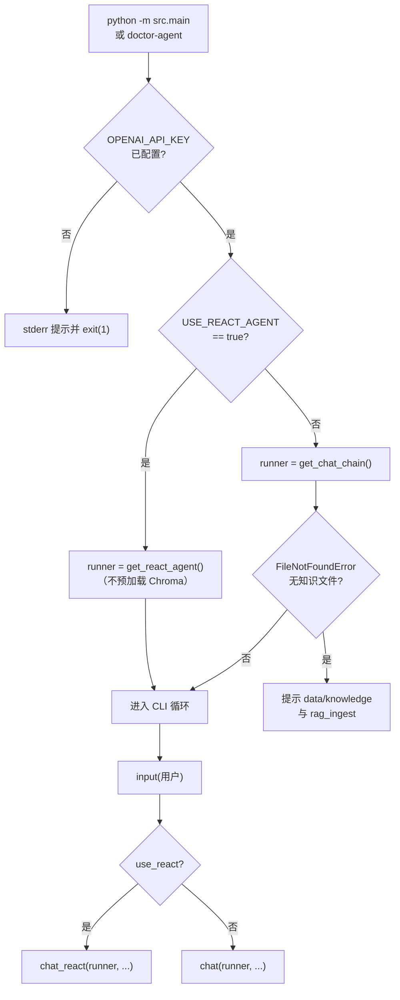
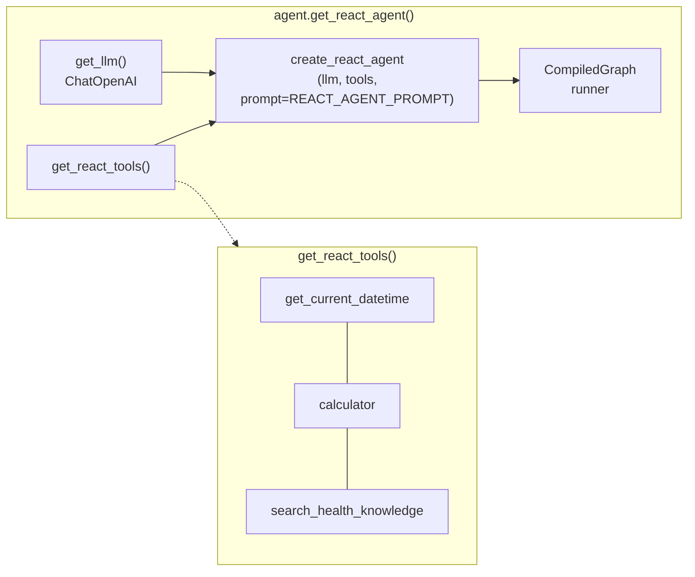
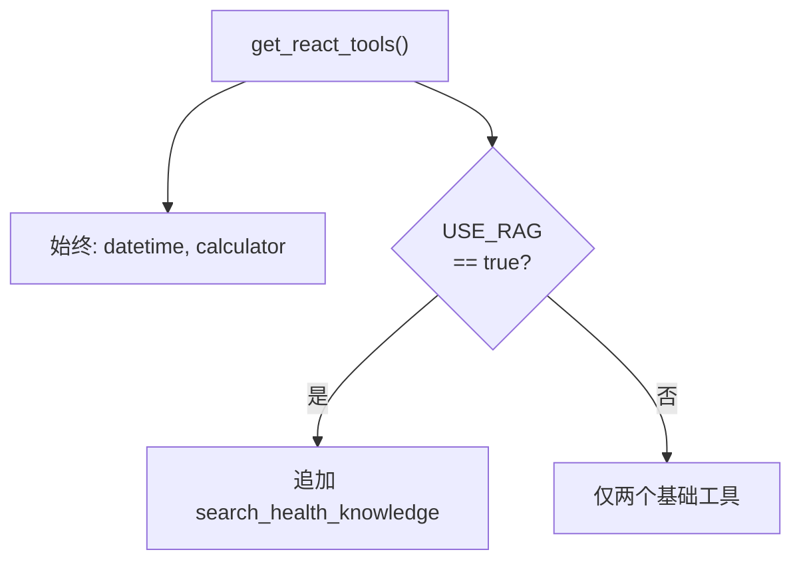
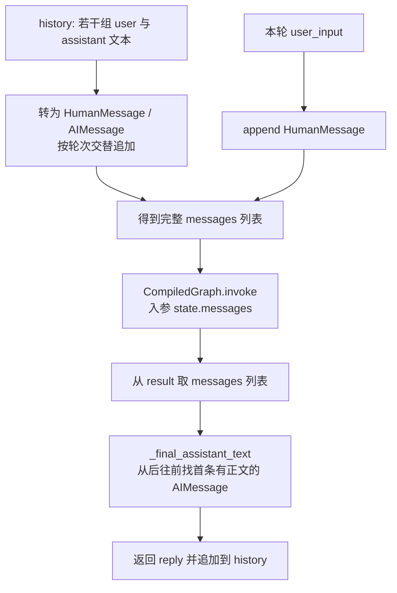
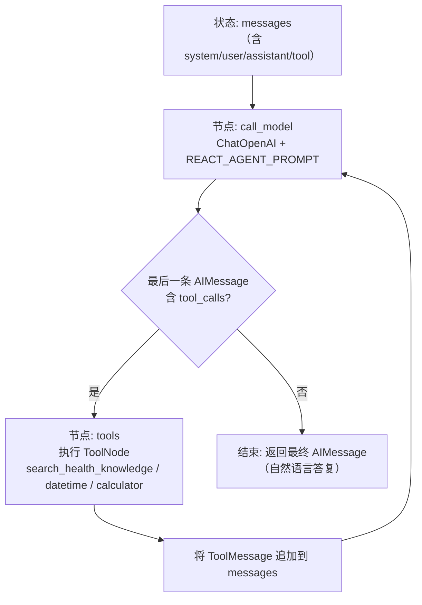
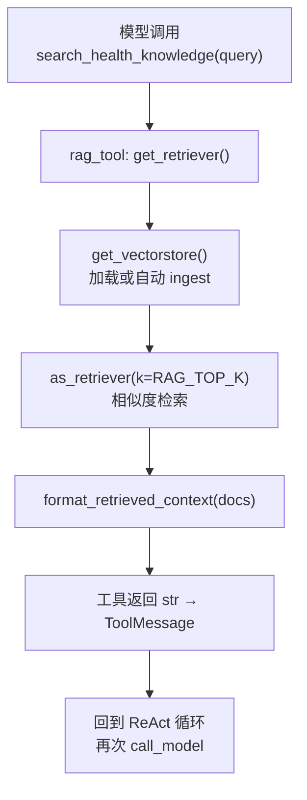
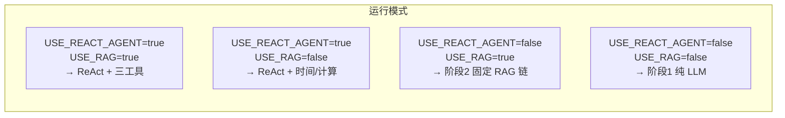

# 阶段 3 代码运行逻辑图（ReAct Agent + Tools：`USE_REACT_AGENT=true`）

> **说明**：阶段 3 在 **`.env` 中 `USE_REACT_AGENT=true`（默认）** 时生效。入口 **`main.py`** 构建 **`get_react_agent()`**（LangGraph **`create_react_agent`**），每轮通过 **`chat_react`** 调用 **`CompiledGraph.invoke({"messages": ...})`**。模型**按需**调用工具（时间、计算器、可选知识库检索）；**不在启动时**强制加载 Chroma。  
> 向量库 **ingest / `get_vectorstore` 决策** 与阶段 2 相同，见 **[PHASE2_RUN_FLOW.md](./PHASE2_RUN_FLOW.md)**。  
> 知识点总结见 **[PHASE3_LEARNING.md](./PHASE3_LEARNING.md)**。

以下使用 [Mermaid](https://mermaid.js.org/)，在 VS Code / Cursor 装 Mermaid 插件，或粘贴到 [Mermaid Live Editor](https://mermaid.live/) 预览。

---

## 1. 入口：`main.py` 选阶段 2 链还是阶段 3 Agent



**要点**：

- **`USE_REACT_AGENT=false`** 时走阶段 1/2 的 **`get_chat_chain()`**；若 **`USE_RAG=true`** 且无知识文件，启动可能失败（与阶段 2 一致）。  
- **阶段 3** 启动**不要求**本地已有 `chroma.sqlite3`；首次调用 **`search_health_knowledge`** 时才会 **`get_vectorstore()`**（可能自动 ingest）。  
- **观察 ReAct 流程**：在项目根目录 **`.env`** 设置 **`REACT_VERBOSE=true`**，保存后**务必重启** `python -m src.main`。启动后应看到一行 **`ReAct 调试日志: 已开启`**；每轮对话会先打印调试块（含 **`stream_mode="values"`** 各步摘要 + **完整消息链**），再显示助理回复。若仍为「未开启」，说明变量未载入（路径不对、拼写错误或未重启）。PowerShell 临时启用（当前窗口）：`$env:REACT_VERBOSE="true"; poetry run python -m src.main`。

---

## 2. 构建 Agent：`get_react_agent()` 与工具列表





---

## 3. 单轮对话：`chat_react` 如何组装 `messages`



代码里等价于：`agent_graph.invoke({"messages": messages})`（图中不写花括号与引号，避免 Mermaid 与 `]` 解析冲突）。

**要点**：图的输入契约是 **`messages`**，不是阶段 2 的 **`input` + `history` 占位符**；历史被**物化**为消息对象。

---

## 4. ReAct 循环（逻辑示意，与 LangGraph 预置图一致）

预置 **`create_react_agent`** 本质是：**模型节点** 与 **工具节点** 交替，直到模型不再请求工具并给出最终答复。



**与阶段 2 对比**：

| 阶段 2（`get_rag_chat_chain`） | 阶段 3（ReAct） |
|-------------------------------|-----------------|
| 每轮**固定** `retriever.invoke` 一次 | **仅当**模型调用 `search_health_knowledge` 时才检索 |
| LCEL 一条链：`Lambda → Prompt → LLM` | 图内可能**多次**调用 LLM（工具轮 + 总结轮） |

---

## 5. 工具 `search_health_knowledge` 触发时的 RAG 子路径

与阶段 2 **共用** `get_retriever()` → `get_vectorstore()`；向量文件与 ingest 流程见 **PHASE2_RUN_FLOW**。



---

## 6. 配置开关一览（阶段 2 ↔ 阶段 3）



---

## 7. 相关源码索引

| 步骤 | 文件与符号 |
|------|------------|
| CLI 分支 | `src/main.py` → `main()` |
| Agent 构建 | `src/agent.py` → `get_react_agent()`, `get_react_tools()` |
| 多轮封装 | `src/agent.py` → `chat_react()`, `_final_assistant_text()` |
| 系统提示 | `src/prompts.py` → `REACT_AGENT_PROMPT` |
| 工具实现 | `src/tools/rag_tool.py`, `src/tools/basic_tools.py` |
| 检索与向量库 | `src/rag.py`（与阶段 2 共用） |

---

## 8. 进一步细化：单次 `invoke` 里发生了什么？（messages 逐步推演）

下面用**同一轮用户输入**、**两种典型情况**，对照 `src/agent.py` 里的 **`chat_react`**，帮你把 LangGraph 里「图跑一圈」和 **API 调了几次** 对齐。  
术语 **`tool_calls`**、**`ToolMessage`**、**`tool_call_id`** 与 **场景 B** 的逐条对应见 **§8.3.1**。

### 8.1 进入 `invoke` 之前：`chat_react` 拼好的列表

假设 `history` 里已有 1 轮对话：`[("你好", "你好，有什么可以帮您？")]`，本轮用户说：`"布洛芬一天最多吃几次？"`。

`chat_react` 会构造（逻辑上等价于）：

| 顺序 | 消息类型 | 内容概要 |
|------|----------|----------|
| 1 | `HumanMessage` | `"你好"` |
| 2 | `AIMessage` | `"你好，有什么可以帮您？"`（**无** `tool_calls`，来自上一轮最终回复） |
| 3 | `HumanMessage` | `"布洛芬一天最多吃几次？"` |

然后执行：

```python
result = agent_graph.invoke({"messages": messages})
```

此时 **还没有** `ToolMessage`，也还没有本轮新的 `AIMessage`。  
图内部的 **`create_react_agent(..., prompt=REACT_AGENT_PROMPT)`** 会在**调用模型**时把你配置的 **系统提示**（人设 + 工具使用策略）交给 Chat 接口，与上面的 `messages` 一起构成「模型眼里」的完整上下文（具体是每条请求前合并，还是状态里插入 `SystemMessage`，由 LangGraph 当前实现负责，**你只需理解：模型总能看到 `REACT_AGENT_PROMPT` 的约束**。）

---

### 8.2 场景 A：模型决定「不调工具」，直接回答

**流程**：`call_model` **只执行 1 次** → 路由判断「最后一条 AI 没有 `tool_calls`」→ **结束**。

**`result["messages"]` 在原有 3 条基础上**，末尾多 1 条：

| 顺序 | 消息类型 | 说明 |
|------|----------|------|
| 4 | `AIMessage` | `content` 为给用户看的完整答复；**无** `tool_calls` |

**API 消耗**：约 **1 次** Chat Completions（本场景）。

**`chat_react` 如何取回复**：`_final_assistant_text` 从后往前找**第一条带正文的** `AIMessage`，这里就是第 4 条。

---

### 8.3 场景 B：模型决定调用 `search_health_knowledge`（典型 ReAct）

**第 1 次 `call_model`**：

- 模型返回的 `AIMessage` 可能 **`content` 为空或很短**，但带有 **`tool_calls`**，例如：工具名 `search_health_knowledge`，参数 `query="布洛芬 用法用量 每日最大剂量"`。

此时 `result["messages"]` 在 invoke **尚未结束**，图会继续走：

| 阶段 | 新增消息 | 说明 |
|------|----------|------|
| 第 1 次模型后 | `AIMessage`（含 `tool_calls`） | 表示「我要去查库」 |
| 工具节点执行后 | `ToolMessage` | `content` 为 `format_retrieved_context` 拼好的检索文本；`tool_call_id` 与上面对齐 |

**第 2 次 `call_model`**：

- 模型**已经看到**检索片段（在 `ToolMessage` 里），生成**最终** `AIMessage`：**自然语言回答用户**，且通常 **不再带** `tool_calls`。

**`result["messages"]` 最终**（在场景 B、只调 1 个工具时）大致比进入时 **多 3 条**：

1. 带 `tool_calls` 的 `AIMessage`  
2. `ToolMessage`（检索结果字符串）  
3. 最终答复的 `AIMessage`（纯文本）

**API 消耗**：约 **2 次** Chat Completions（第 1 次决定工具 + 第 2 次根据工具结果作答）。若模型在一轮里连续多调几个工具，还可能是 **2 次以上**（中间夹多段 `ToolMessage`）。

#### 8.3.1 `tool_calls` 与 `ToolMessage`：和场景 B 逐条对上号

下面把两个概念**钉在场景 B 的三条新增消息**上（与上文「多 3 条」一致）。

| 顺序（相对本轮 invoke 结束后的列表） | 消息类型 | 和 `tool_calls` / `ToolMessage` 的关系 |
|--------------------------------------|----------|----------------------------------------|
| 第 1 条新增 | **`AIMessage`** | 字段 **`tool_calls`** 为**非空列表**。列表里每一项通常包含：**`name`**（如 `search_health_knowledge`）、**`args`**（如 `query=...`）、**`id`**（唯一字符串，后面叫 **tool_call_id**）。此时 **`content`** 可以很短甚至为空——重点在「模型下令调工具」。 |
| 第 2 条新增 | **`ToolMessage`** | **不是**模型生成的，是**运行时**执行完 Python 工具后写入的。字段 **`content`** = 工具返回值（本项目里即 `format_retrieved_context` 拼好的检索文本）。字段 **`tool_call_id`** **必须等于**上一步 `tool_calls` 里对应那一项的 **`id`**，这样下一轮模型才知道「这条结果是哪次调用产生的」。 |
| 第 3 条新增 | **`AIMessage`** | 模型已读到 **`ToolMessage`**，生成**给用户看的最终答复**；通常 **`tool_calls` 为空**（或不再继续调工具），**`content`** 为完整自然语言。 |

**一条线串起来**：

```text
AIMessage(tool_calls=[{id, name, args}])
    → 框架执行 name 对应函数(args)
    → ToolMessage(content=返回值, tool_call_id=id)
    → 再次 call_model
    → AIMessage(content=最终回答, 一般无 tool_calls)
```

本项目里 **② 的执行与 `ToolMessage` 的构造**由 LangGraph 预置图（`create_react_agent` 内的工具节点）完成，你只需实现 **`@tool` 函数**并保证返回 **字符串**。

若模型在一轮里返回 **多个** `tool_calls`，通常会对应 **多条** `ToolMessage`（每条各自 **`tool_call_id`**），再进入下一次 `call_model`。

---

### 8.4 `_final_assistant_text` 为什么要「从后往前」找？

- **最后一条**不一定是「给用户看的答案」：若实现上最后一条仍是带 `tool_calls` 且无正文的 `AIMessage`，直接取最后一条会空。  
- 从后往前找 **第一条 `content` 非空的 `AIMessage`**，在常见流程里对应 **最终总结**那条（场景 B 里第 3 条新增 AI）。

若整条链都没有合格正文，代码里会fallback：`（本轮未生成可见答复，请重试或简化问题。）`（见 `chat_react`）。

---

### 8.5 重要：`history` 里**不保存** `ToolMessage`

`chat_react` 结束时只往 `history` 里追加 **`(user_input, ai_text)`** 二元组，**不会**把 `ToolMessage`、中间带 `tool_calls` 的 `AIMessage` 存进 `history`。

**下一轮**再进 `invoke` 时，重建的 `messages` 仍是：

`[Human, AIMessage(上一轮最终可见回复), Human(新输入), ...]`

**含义**：

- **优点**：CLI 简单、token 省、和「人类对话记录」一致。  
- **代价**：模型**看不到**上一轮「当时检索到的原始片段」，只看到**当时已经总结进助理回复**里的内容。若你要让多轮深度依赖工具原始输出，需要改成把更多消息（或摘要）持久化进 state——属于进阶改造。

---

### 8.6 和阶段 2 同一问题的对比（加深记忆）

| 维度 | 阶段 2 `get_rag_chat_chain` | 阶段 3 `chat_react` |
|------|-----------------------------|---------------------|
| 检索时机 | **每轮**在进 LLM 前**必定** `retriever.invoke` | **仅当**模型调用 `search_health_knowledge` |
| 单次用户输入对应的 Chat 调用次数 | 通常 **1 次** | **1～多次**（有工具则 ≥2 常见） |
| 消息里是否出现 `ToolMessage` | 无（检索结果在 `system` 模板变量里） | 有（标准 tool calling 流程） |

以上内容可与 **第 4、5 节** 的流程图对照阅读。
