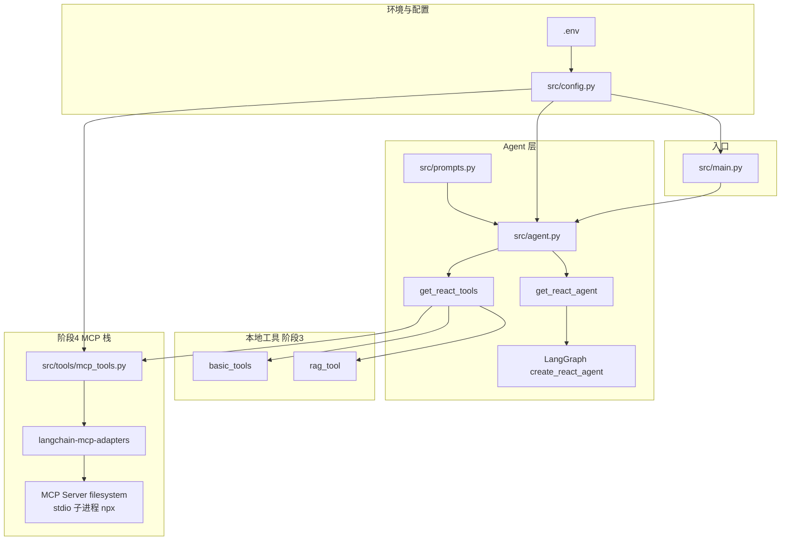

# 阶段 4 新手向知识点详解（MCP）

> 面向：已经能跑通 **阶段 3（ReAct）**，想**真正理解 MCP 是什么、和 RAG/本地工具有什么区别**的同学。  
> 本文尽量用**日常比喻 + 分步说明 + 正反例**，不再默认你已经熟悉「协议 / 子进程 / 工具名冲突」等词。  
> **操作步骤（配环境、改 .env、验收）** 仍以 **[PHASE4_RUN_FLOW.md](./PHASE4_RUN_FLOW.md)** 为准；阶段 3 总览见 **[PHASE3_LEARNING.md](./PHASE3_LEARNING.md)**。

---

## 1. 先用一句话回答：阶段 4 到底多干了什么？

在阶段 3 里，模型能调用的能力主要有三类，**都写在你自己的 Python 里**：

- 查知识库：`search_health_knowledge`  
- 看时间：`get_current_datetime`  
- 算数：`calculator`  

**阶段 4 做的是**：再挂一批工具，这些工具的**真正实现不在你的 `src/tools/*.py` 里**，而在**另一个程序**里——叫 **MCP Server**（本项目默认是官方 **filesystem**，用 Node 跑起来）。  
你的程序通过 **MCP Client（适配器）** 跟它说话，把它暴露的能力变成 LangChain 也能用的 **Tool**，和上面三类拼在一起交给 **ReAct Agent**。

**为什么要多此一举？**

- **标准化**：同一类能力（读文件、访问某 SaaS）可以用**同一套协议**接进来，不必每个项目手写一遍读盘逻辑。  
- **隔离**：读盘逻辑在**单独进程**里，权限边界可以收紧（只允许某个目录）。  
- **复用**：社区 / 官方已经有很多 MCP Server，可渐进接入。

---

## 2. 三个词：Server / Client / Tool（吃透它们）

下面用**餐厅类比**，再落到**技术含义**和**你们仓库里的对应物**。

### 2.1 类比（帮助建立直觉）

| 角色 | 类比 | 它干什么 |
|------|------|----------|
| **MCP Server** | **后厨** | 真正炒菜：读文件、调外部 API、查数据库等**具体动作**都在这里做。 |
| **MCP Client** | **服务员 + 点菜系统** | 把你的应用（Agent）要的「菜式」（工具调用）翻译成后厨能懂的单子，把做好的菜端回来。 |
| **Tool（工具）** | **菜单上的一道菜名** | 写清楚**菜名**、**配料（参数）**、**简短说明**；**做法在后厨**，不在菜单上。 |

模型在对话里永远不会「手伸进后厨」，它只能对 **Client** 说：「我要点这道菜，参数是这样。」Client 再找 **Server** 执行。

### 2.2 技术含义（你需要能复述）

**Server**

- 是一个**单独跑着的程序**（本项目里是 `npx … @modelcontextprotocol/server-filesystem` 拉起的进程）。  
- 向协议对方宣告：我提供哪些 **Tool**（以及 Resource / Prompts 等，阶段 4 你主要碰 **Tool**）。  
- **实现**每个 Tool 背后的逻辑：例如「在允许目录下列目录、读文件」。

**Client**

- 跑在**你的应用进程**一侧（Python 里通过 **`langchain-mcp_adapters`**）。  
- 负责：**连接** Server、**列出**工具、**把工具的 JSON Schema 转成 LangChain 的 Tool**、在模型发起 **tool_calls** 时**转发**给 Server 并**把结果塞回**对话（最终变成 **`ToolMessage`**，概念同阶段 3）。

**Tool**

- 在协议里是一段**声明**：`name`、`description`、参数结构（JSON Schema）。  
- **执行代码在 Server**；Client 只负责**转发调用**。  
- 对**模型**来说，MCP 转出来的 Tool 和本地的 `search_health_knowledge` **看起来一样**：都是「可调用的函数列表」里的一项。

### 2.3 在本项目里「谁是谁」？

| 概念 | 在你电脑上的对应 |
|------|------------------|
| **Server** | Node 起的 **filesystem** 进程；只能访问 **`MCP_FILESYSTEM_ROOT`**（默认 `data/mcp_allowed`） |
| **Client** | `MultiServerMCPClient`（在 **`src/tools/mcp_tools.py`** 里用） |
| **Tool** | `get_tools()` 返回的一串 **`BaseTool`**，名字常带 **`fs_`** 前缀，并入 **`src/agent.py`** 的 `get_react_tools()` |

---

## 3. 传输方式：stdio 和 HTTP 分别是啥？适不适合你？

### 3.1 先搞清「传输」指什么

**传输** = Client 和 Server 之间**比特流怎么走**：走**管道**，还是走**网卡**。

### 3.2 stdio（标准输入输出）——你们当前默认

**是什么**：启动 Server 时，它是本机的一个**子进程**；父子进程之间用**管道**传 MCP 消息（像用一根「管子」说话），**一般不单独占一个对外 HTTP 端口**。

**像什么**：在你自己电脑上开的小作坊——**顾客（Agent）和后厨（Server）在同一栋楼**，菜从传菜口递进去，**外人从网路上打不进来**。

**适合什么场景**

- **个人开发、本机 CLI、IDE 插件**（Cursor 等也常这样起 MCP）。  
- **不想**给 MCP 再配端口、TLS、防火墙规则时。  
- **信任边界**是「本机用户」：谁跑 Agent 谁就能按配置拉起 Server。

**局限**

- **默认不是「远程共享服务」**：别人电脑上的盘，不会自动通过 stdio 暴露给你；要远程通常换 **HTTP** 或自己做隧道。  
- 依赖运行环境：例如要有 **Node + npx**（你们当前方案）。

### 3.3 HTTP / SSE / Streamable HTTP —— 另一种常见形态

**是什么**：MCP Server **常驻成网络服务**，Client 用 **URL** 连接（有的用长连接推送事件）。

**像什么**：**连锁中央厨房**——很多门店（很多 Agent 实例）都向**同一个 URL** 下单。

**适合什么场景**

- **多用户、多机、K8s**：希望**一个 MCP 集群**被很多客户端共用。  
- Server 用 **别的语言**单独部署，Python Agent 只管连 URL。  
- 要在 **网关** 上做鉴权、限流、HTTPS。

**代价**

- 运维：端口、证书、监控、防刷；  
- 安全：等于对外暴露「可调用能力」，必须控好权限。

### 3.4 一表对照（背这张就够选型）

| 维度 | stdio | HTTP 等 |
|------|--------|---------|
| 典型部署 | 本机子进程 | 独立网络服务 |
| 对外暴露 | **默认几乎不暴露**（管道） | **显式暴露**（要自己做安全） |
| 适合谁 | 本地学习、单机产品原型 | 团队共享、远程、多实例 |
| 你们当前 | **默认** | 未接（以后可在 `config` 里加 `transport: http` 类配置） |

---

## 4. RAG 检索 和 MCP 读文件：别混成「都是在查资料」

这是很多新手最晕的地方：**两者都和「文字材料」有关，但解决的问题完全不同**。

### 4.1 各自在解决什么问题？

**RAG（你们：`search_health_knowledge`）**

- **问题**：有一堆**已索引**的文档片段，用户用**自然语言提问**，你要找到**语义上最相关**的几段话给模型参考。  
- **输入**：更像「**意思**」——例如「布洛芬一天最多吃几次」。  
- **输出**：**若干片段**（Top-K），**不保证**覆盖某一篇文档的全文，也**不保证**你知道文件名。  
- **底层**：向量相似度检索（embedding + 向量库）。

**MCP 读文件（你们：`fs_*` + filesystem Server）**

- **问题**：在**指定根目录**里，按**路径/文件名**做**列目录、读全文**等（以具体工具为准）。  
- **输入**：更像「**位置**」——例如「读 `用药备忘示例.txt`」「这个文件夹里有哪些 `.txt`」。  
- **输出**：**目录列表或文件原文**（取决于调了哪个 fs_*）。  
- **底层**：操作系统文件 API（Server 里实现），**不是**向量相似度。

### 4.2 用同一句用户话看「该谁上场」

| 用户说法 | 更倾向 | 原因（一句话） |
|----------|--------|----------------|
| 「感冒药和阿司匹林能一起吃吗？」 | **RAG** | 问的是**医学常识/说明书式信息**，未必有固定文件名。 |
| 「读一下我放在允许目录里的 `用药备忘示例.txt`」 | **MCP** | 明确要点名**某一文件**的**原文**。 |
| 「把我备忘录里关于阿司匹林那一条念出来」 | **若知道文件名** → MCP；**只有模糊印象** → 可先 **MCP 列目录** 再找，或把备忘也做进知识库用 **RAG** | 实际产品里常 **两者并存**，但要 **分工清晰**。 |

### 4.3 「不应混用」具体指什么？

不是说你**绝对不能**同一轮里两个都调，而是：

- **不要用 RAG 代替「读指定文件全文」**：RAG 返回的是**片段**，不是可靠的全文再现。  
- **不要用 MCP 代替「大海捞针式常识问答」**：你不知道路径时只能先列目录、猜测，效率低；**语义泛泛问题**应优先 **RAG**。  
- **不要在 Prompt 里把两者描述成同一个东西**：否则模型会乱选工具；所以你们有 **`REACT_AGENT_MCP_HINT`** 专门拆清。

---

## 5. `tool_name_prefix`：解决「重名」这种工程雷

### 5.1 问题从哪来？

模型选工具时，**只看到一个扁平的列表**，例如：

- `read_file`  
- `read_file`  ← 又来一个？  
- `search`  

如果两个工具真的**同名**，API / 框架很难保证「每次都命中你想的那个」；模型的 **tool_calls** 里也容易出现**歧义**。

**典型来源**

- 接了 **两个 MCP Server**，它们都实现了类似 `read_file`；  
- 或者 MCP 工具名和你自己写的 `@tool` **撞名**。

### 5.2 `tool_name_prefix=True` 在干什么？

给工具名**加命名空间前缀**，通常用 **你在配置里给这个 Server 起的名字**（你们配置里叫 **`fs`**），于是可能出现：

- `fs_read_file`  
- `other_read_file`  

这样模型和人类一眼能看出：**这是 filesystem 这套实现**。

### 5.3 你要记住的工程结论

- **多来源并表** 时，前缀是**廉价又有效**的防冲突手段。  
- 写 Prompt 时要**用模型实际看到的名字**（带 `fs_`），不要假设还叫裸的 `read_file`。

---

## 6. 走一遍：用户说「读某个 txt」时大概发生什么？（stdio）

下面 Steps 帮你把 **Server / Client / Tool** 串成一条线（细节随适配器版本可能略有差异，**逻辑顺序**是这样）：

1. 你已启动 **Agent**（`main.py`），且 **`USE_MCP=true`**。  
2. 某处代码会 **拉起或连接** filesystem **Server**（stdio 子进程）。  
3. **Client** 向 Server 要「工具列表」，得到若干 **Tool 声明**，转成 LangChain **Tool** 交给 **ReAct**。  
4. 用户输入：**「请读 data/mcp_allowed 里 xxx.txt」**。  
5. **大模型**根据 System Prompt + 工具说明，输出 **tool_calls**：例如调用某个 **`fs_*`**，参数里带路径。  
6. **LangGraph** 执行工具 → 实际走到 **MCP Client** → **IPC 到 Server**。  
7. **Server** 在**允许根目录**内读盘，把结果返回。  
8. 结果被包成 **ToolMessage**，模型再生成**最终自然语言回答**。

你在阶段 3 若开过 **`REACT_VERBOSE=true`**，可以同样观察 **一轮里是否出现 tool_calls 和 ToolMessage**；阶段 4 只是工具实现从「本地 Python」变成了「MCP Server」。

---

## 7. 和「纯 LangChain `@tool`」比一比

| 对比项 | 本地 `@tool`（如 `rag_tool`） | MCP Tool（如 `fs_*`） |
|--------|------------------------------|------------------------|
| 代码在哪 | 你的 `src/tools/*.py` | **MCP Server** 进程里 |
| 部署 | 随 Python 进程 | 还要满足 Server 依赖（如 Node） |
| 更新方式 | 改 Python 发版 | 可替换 Server 或升级 npm 包 |
| 权限控制 | 你在函数里自己判断 | 常由 **Server 根目录 + OS 权限** 约束 |
| 适用 | 轻量、强定制、和项目强绑定 | **标准能力、可复用、多应用共享** |

---

## 8. 常见误解（新手 FAQ）

**Q：MCP 是不是「又一个向量库」？**  
A：不是。向量库服务 **RAG**；MCP 是 **协议 + 一类外部能力**；filesystem MCP 管的是**文件系统操作**，不是语义检索。

**Q：用了 MCP 还要 RAG 吗？**  
A：要。两者**解题不同**；现实产品里经常**并存**（见 §4）。

**Q：stdio 模式下 MCP Server 在别的电脑上行吗？**  
A：**默认不行**；stdio 是本地子进程管道。要远程请考虑 **HTTP MCP** 或其它网络方案。

**Q：模型怎么知道该用 `fs_` 还是 `search_health_knowledge`？**  
A：靠 **工具 description** + **System Prompt**（`REACT_AGENT_MCP_HINT`）；写清楚是**阶段 4 必做功课**。

---

## 9. 自测题（建议先做再对答案）

1. 用你自己的话解释：**Server 和 Client 哪个「真的读硬盘」？**  
2. 用户问「维生素 C 一般有什么作用」，你优先 RAG 还是 MCP？为什么？  
3. 用户问「读允许目录下的 `a.txt` 全文」，你优先 RAG 还是 MCP？为什么？  
4. 为什么要 `tool_name_prefix`？举一个「不重名就出事」的例子。  
5. stdio 和 HTTP，哪个更适合「全公司共用一个文件 MCP 服务」？

### 参考答案

1. **Server** 读硬盘；Client 只负责传话。  
2. **优先 RAG**；这是**语义常识**，未指定文件路径。  
3. **优先 MCP**；要的是**指定文件原文**，RAG 片段不可靠。  
4. 两个 Server 都有 `read_file` 时会**歧义**；前缀如 `fs_read_file` / `other_read_file` 可区分。  
5. **HTTP**（或中心化部署的网络 MCP）；stdio 适合本机子进程。

---

## 10. 附录：阶段 4 模块依赖简图

下图只画 **与 MCP 接入相关** 的依赖与数据流（不含阶段 1～3 全部细节）。可在支持 Mermaid 的编辑器中预览本仓库其它文档的方式预览。



**读图要点（按箭头方向）**

1. **`.env` → `config.py`**：决定是否 **`USE_MCP`**，并生成 **`MCP_SERVER_CONNECTIONS`**（stdio 命令与目录根）。  
2. **`main.py` → `agent.py`**：ReAct 模式下 **`get_react_agent()`** 会调用 **`get_react_tools()`**。  
3. **`get_react_tools()`** 在 **`USE_MCP`** 时调用 **`mcp_tools.get_mcp_tools_or_empty()`**，内部用 **`MultiServerMCPClient`** 连 **Node 起的 filesystem**，得到 **`fs_*` LangChain 工具**并与本地工具合并。  
4. **`prompts.py`** 的 **`REACT_AGENT_MCP_HINT`** 经 **`_react_system_prompt()`** 并入 ReAct 的 system，不改变 `rag.py` 等阶段 2 代码路径。

**ASCII 缩略版（无 Mermaid 时扫一眼）**

```
.env ──► config.py ──┬──► main.py ──► agent.py ──► create_react_agent ──► LangGraph
                     │         │            ▲
                     │         └────────────┘
                     │
                     ├──► MCP_SERVER_CONNECTIONS ──► mcp_tools.py
                     │                                      │
                     └──────────────────────────────────────┼──► MultiServerMCPClient
                                                            └──► stdio ──► npx filesystem
```

---

## 11. 本项目文件索引（对照代码看）

| 主题 | 文件 |
|------|------|
| MCP 连接配置 | `src/config.py`（`MCP_SERVER_CONNECTIONS` 等） |
| 拉取 MCP 工具 | `src/tools/mcp_tools.py` |
| 与 ReAct 合并 | `src/agent.py`（`get_react_tools`、`_react_system_prompt`） |
| Prompt 补充说明 | `src/prompts.py`（`REACT_AGENT_MCP_HINT`） |
| 允许读写的目录说明 | `data/mcp_allowed/README.md` |
| 操作与验收 | [PHASE4_RUN_FLOW.md](./PHASE4_RUN_FLOW.md) |
| 依赖简图 | 本文 **§10 附录** |

---

*文档为学习笔记性质；MCP 规范与适配器行为以官方文档与当前依赖版本为准。*
